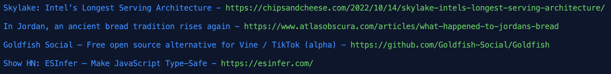

# hackernews-scraper

This is a simple project, intended to help me learn the V programming language.
It's a simple program that when is being run, scrapes the hackernews front-page and prints all the latest posts and links to their sources. 

Example for what the program does:

